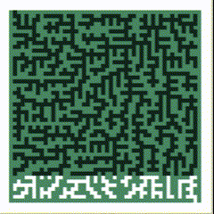
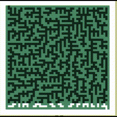
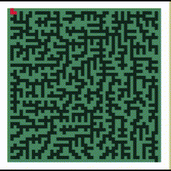
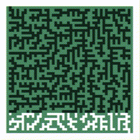
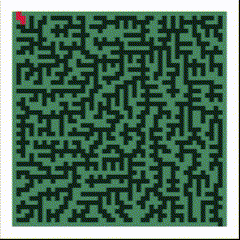

# My Little Maze-Solver, and IA-Search-Algorithm Approach


Below you will find a brief overview of the algorithms presented on the project. This proposal was developed for "Introduction to Artificial Intelligence" (Universidad Nacional de Colombia).

# Table of Contents
- [Introduction](#introduction)
- [The BFS Algorithm](#the-bfs-algorithm)
- [The DFS Algorithm](#the-dfs-algorithm)
- [The IDS Algorithm](#the-ids-algorithm)
- [The UCS Algorithm](#the-ucs-algorithm)
- [The Greedy Algorithm](#the-greedy-algorithm)
- [The A* Algorithm](#the-a-star-algorithm)
- [Installation and dependencies](#instalation-and-dependencies)
- [Contact](#contact)

<br><br><br>

## Introduction
[(Back to top)](#table-of-contents)

The intention of this project is to visualize and compare search algorithms to solve mazes by using various brute-force and heuristic algorithms. The front-end is coded in JavaScript with the Nuxt 3 framework and the algorithms are implemented in Python. At the end of the document there's an explanation on how to deploy the repository locally.

In the code, mazes are considered trees, turned into Graphs and each individual cell is considered a node. The purpose of this is to make the coding easier to do and easier to read. Also, all the algorithms implemented in this repository are algorithms for searching a tree data structure for a node.

## The BFS Algorithm
[(Back to top)](#table-of-contents)

**`Breadth-first search (BFS)`** explores all cells at the same distance to the start point prior to moving on to the nodes at the next distance level. This algorithm implements a First-in-First-out (FIFO) structure to queue the exploration paths.<br><br>

<p align="center" width="100%">
  
</p>

This is a non-recursive implementation that marks wether a vertex has been visited or not.

## The DFS Algorithm
[(Back to top)](#table-of-contents)

**`Depth-first search (DFS)`** explores all cells within the same branch prior to moving on to the next branch. The branches can be seen as it follows:<br><br>

<p align="center" width="100%">
  
</p>

In contrast to BFS, this algorithm implements a Last-in-First-out (LIFO) structure using a stack to queue the exploration paths. This is a non-recursive implementation that marks wether a vertex has been visited or not.

## The IDS Algorithm
[(Back to top)](#table-of-contents)

The last two algortims were not efficient by their own. **`BFS`** takes a lot of space to traverse the whole tree. If the objective node is a leaf (very far from start), BFS takes a lot of time to reach the node. On the other hand, **`DFS`** has problems when the objective node is not on one of the first branches, but in one of the last. This also makes DFS inneficient to reach that node, since it takes a lot of time.

**`Iterative-Depth search (IDS)`** combines DFS's space-efficiency and BFS's fast search (for nodes closer to root). This is done by calling a DFS function for different increasing depths, this is, calling DFS in a BFS way.<br><br>

<p align="center" width="100%">
  
</p>

This algorithm is recursive over the depth of each dive. DFS and BFS algorithms are just like the former algorithms.

## The UCS Algorithm
[(Back to top)](#table-of-contents)

The following Algorithms were designed with `heuristic functions` which are functions that decide the path to take in a search-algorithm based on available information. The function used was the **`Manhattan Distance`**, which is defined as:

$$ d((a,b), (c,d)) = |a-c|+|b-d| $$

for any two pair of nodes.

In **`Uniform-Cost Search (UCS)`**, every time a node wants to explore it's neighbors, the lesser-value heuristic is chosen. The distance is measured as the distance between **the origin and the possible node**. The UCS algorithm guarantees the optimum solution.<br><br>

<p align="center" width="100%">
  
</p>

## The Greedy Algorithm
[(Back to top)](#table-of-contents)

In the **`Greedy Search Algorithm `**, the heuristic value is calculated as the distance between **the possible node and the objective node**. The Greedy algorithm is complete, as it always returns a solution if exists. However, it doesn't guarantee an optimal solution.<br><br>

<p align="center" width="100%">
  
</p>

## The A-Star Algorithm
[(Back to top)](#table-of-contents)

In the **`A* Algorithm `**, the heuristic value is a combination of the two former heuristics. It is calculated as the distance between **the possible node and the objective node** plus the distance between **the origin and the possible node**. The A* algorithm is complete and it guarantees an optimal solution.<br><br>

<p align="center" width="100%">
  
</p>

## Instalation and Dependencies
[(Back to top)](#table-of-contents)
As a general requirement, is is mandatory to have **`Python`** and **`Node.js`** installed.

After cloning this repository and entering the directory, follow this steps:

First, enter the `src/api/` folder and execute

```pip install -r requirements.txt```

Then, change directory to the folder `src/ui/` and excecute

```npm install```

```npm run dev```

After that, in another terminal open the folder `src/api/` and excecute

```python main.py```

Finally, open any web browser and traverse to

**`localhost:3000`**

to view the app.

## Contact
[(Back to top)](#table-of-contents)

This repository was developed by [Juan Pablo Urrutia](https://github.com/jurrutiap), [Pablo Andres Dorado](https://github.com/pandres95) and [Pablo Gonzalez](https://github.com/pgonzalezb4). Any questions, please don't hesitate to reach out.
